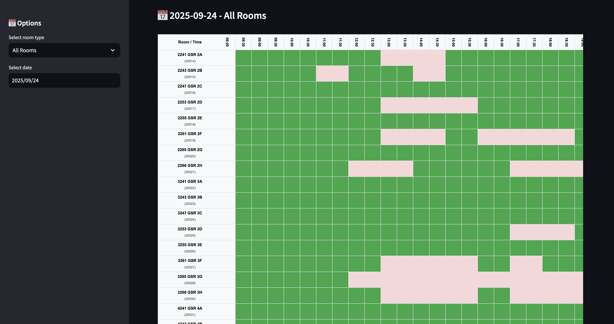

# Better Robarts Timetable

University of Toronto Robarts Library Study Room Availability Query System



## Features

- Batch retrieval of all study room availability
- Support multiple data sources (direct API, local JSON import)
- SQLite database storage for efficient querying
- Web interface display (based on Streamlit)
- Support queries by date range
- **One-click data refresh** - Get latest data directly in web interface
- **Click to book** - Click available time slots to jump to booking page

## Quick Start

### 1. Install Dependencies

```bash
pip install -r requirements.txt
```

### 2. Launch Web Application

```bash
streamlit run app.py
```

### 3. Usage Instructions

1. **Get Data**: Click "🔄 Get Latest Data" button in sidebar to automatically fetch all room data for today and next 2 weeks
2. **View Schedule**: Select room type and date to view availability
3. **Direct Booking**: Click green available time slots to automatically jump to corresponding room booking page

## Interface Guide

- 🟢 **Green Areas** - Available time slots (click to jump to booking)
- 🔴 **Red Areas** - Already booked or unavailable
- ⚪ **Blank Areas** - No data or closed hours

## Project Structure

- `app.py` - Streamlit web application (main usage)
- `script.py` - Data retrieval and processing script (backend call)
- `requirements.txt` - Python dependencies list
- `uoft_study_rooms.db` - SQLite database file
- `uoft_study_rooms.csv` - Room metadata file

## Dependencies

- Python 3.7+
- See `requirements.txt` for details

## Notes

- First-time use requires clicking refresh button in web interface to get data
- Data retrieval may take a few minutes, please be patient
- Recommend clicking refresh button regularly for latest availability information
- Clicking green time slots will open booking page in new tab
